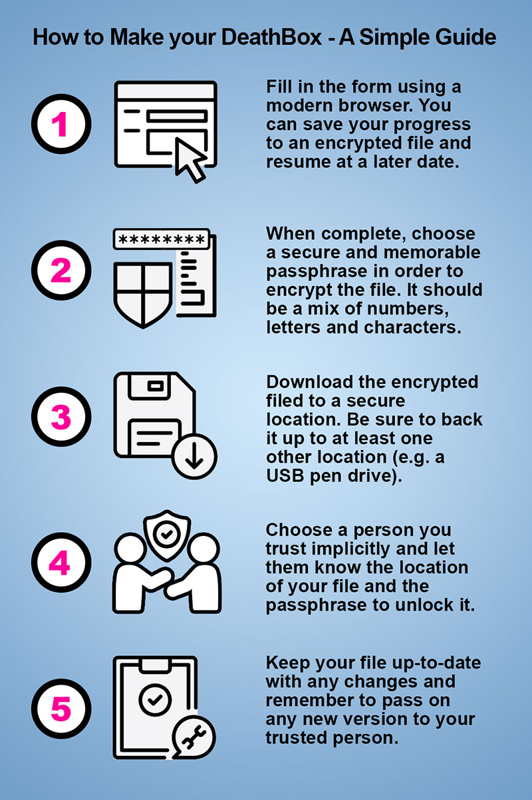

# DeathBox: A Simple Afterlife Archive
## A simple browser-based application to help you create a single, comprehensive document that holds all the key information people may need when you die.

### Too often, the people you leave behind are left guessing. They may not know how to access your devices, manage your online activities or finances, or even who your closest friends were and which people, places and things mattered most to you.

### They might also be unsure of your medical history, where your passport is, or who's going to take care of your dependants, pets, home, car and garden when you're not around. Your DeathBox is also a great place to list your favourite books, films, music, colours and foods, and to leave instructions for how you’d like your funeral or burial to be arranged.

### The more information you provide, the easier it will be for your nearest and dearest to manage your affairs and understand who you were.

### Your death should also be a celebration of your life, and aside from the practical stuff, the things you place into your DeathBox should reflect that.

## Put the kettle on. Gather your thoughts.

Heads up! The form could take a very long time to complete. We strongly recommend preparing all the information you need before entering it here.

The only required fields are your name and the details of the person you appoint to open your DeathBox. Just complete the sections that are relevant or comfortable for you.

For convenience, you can save your progress to an encrypted file and then resume at a later date by using the options below the main form.

## Installation
1. [Download the zip file](https://github.com/DeathBoxes/DeathBoxes/releases/download/v1.81/deathboxes-local.zip)
2. Unzip to a location on your computer or device
3. Locate and open index.html in your browser to run the application 

## Simple Infographic

## Frequently asked Questions

### Q: How secure is my DeathBox?

Let's be real – if a malicious individual got their hands on your DeathBox and managed to read its contents, it could potentially ruin multiple lives, and your own death. Seriously. Your identity could be stolen, homes and property lost, loved ones kidnapped, bank accounts emptied, relationships destroyed and all manner of hell unleashed. Or worse.

Once you've completed the form, entered a passphrase and downloaded your encrypted PDF, make sure you keep it in a secure place, and preferably backed up.

For your DeathBox to be accessible after you're gone, you'll also need to give your passphrase to at least one other person who has the means to visit this webpage (or a local copy of it) and upload the encrypted file. An encrypted DeathBox file or PDF without a passphrase is pretty much useless.

**Basically, your DeathBox is only as strong as the passphrase you use to encrypt it, the confidence you have in those you entrust it to, and the integrity of the device you store it on.**

**No Spying Shenanigans**

I appreciate the highly sensitive nature of the information you provide, and as such, all processing is undertaken within your browser. No third-party cookies are used and absolutely no data whatsoever is stored or transmitted beyond your computer and this page (this page does not use cookies either).

There is no tracking, no back-end database, no server-side processing and no surreptitious storage other than the files you explicitly choose to encrypt and download. Your IP address is of no interest to me, and nothing you enter here is recorded, not even in a log file.

**No Man-in-the-Middle Monkey-Business**

Building your DeathBox is a wholly client-side process, that's to say it happens on your computer. Once your browser has finished loading the application – which includes the HTML, five JavaScript files, a stylesheet, a couple of fonts and favicons (the small icon on the browser's tab) and the logo image (for a total of 12 items, or 13 if the logo is cached) – there are no more HTTP requests. Zero.

The HTML form itself has no action defined, so it literally doesn't submit anything at all (including uploads). The application takes your form responses, compiles and encrypts them into a file, then prompts you to download it. The browser's memory is then cleared and the form is reset.

You can check out exactly what's going on by opening your browser's developer console (F12) and taking a look at the network, memory, storage and cookie sections.

**Content Security**

I've gone to some lengths to lock down the security of the application's headers and content. If you're technically minded and know what you're looking at, you can analyse deathboxes.co.uk yourself via the links below.

[Mozilla Observatory (A+)](https://developer.mozilla.org/en-US/observatory/analyze?host=www.deathboxes.co.uk)

[Security Headers (A+)](https://securityheaders.com/?q=https%3A%2F%2Fwww.deathboxes.co.uk&hide=on&followRedirects=on)

**Encryption**

When you download a PDF or save your progress, the file is encrypted using military-grade SHA-512 hashing, based on a passphrase that you need to provide. To decrypt a file, you (or somebody else) will need to visit the application, enter your passphrase and re-upload the file using the appropriate function.

There is an option to download an unencrypted PDF, but we strongly recommend against doing so for obvious reasons. However, if you need the 'Last Will and Testament' section to be legally valid, you'll need to download an unencrypted PDF, print it out and sign the appropriate sections along with two witnesses.

**ChatGPT Security Audit**

I've run a basic security audit of DeathBoxes using ChatGPT. The results are unsurprising but nonetheless worth a read. It's included in the repository, along with a risk map that ChatGPT also generated.

**Transparency and Disclaimer**

For full transparency, you are more than welcome to download the source code of this page via the option below the form or on Github. Downloading the source code will also allow you to run the application on your local computer or server (ideally using SSL/TLS).

## All that said, I take absolutely no responsibility for the information you enter into your DeathBox, its validity, or any consequences resulting from its misuse, mishandling or unauthorised access. What you do with the contents of your DeathBox is wholly down to you. You have been warned.

### Q: I've lost the passphrase for an encrypted DeathBox. What can I do?

If somebody entrusted you with their encrypted DeathBox without providing a passphrase, or it's been lost or forgotten, I'm afraid there's nothing that can be done. DeathBox files are encrypted using SHA-512 hashing – a one-way process that cannot be bypassed. Passphrases are never saved to a server so there's absolutely no way to recover them.

### Q: What happens if deathboxes.co.uk. is offline or broken?

There may come a time when deathboxes.co.uk is no longer operating. The best thing to do to avoid such an eventuality is to download a copy of DeathBoxes to your local computer. You can also download the DeathBoxes application from Github.

### Q: Who made DeathBoxes?

Me, Russell McVeigh. I'm an editor, developer and musician. And I'm 100% human according to those around me. I'm also somewhat addicted to designing and building little online worlds and applications that most people never see. I thought I'd put this one out there as it's a ridiculously simple idea and was fairly easy to set up. Another one of my pet projects is [Kung Fu Haiku](https://www.kungfuhaiku.com/), which has been pottering along since 2008.

### Q: Is it really free to use

Yes, creating your own DeathBox on deathboxes.co.uk is absolutely free. You're also welcome to download the source code and use it offline. However, it is copyrighted, so I'd really appreciate it if you didn't clone it, sell it or claim it as your own.

If you've found the application useful and are in a particularly generous mood, [feel free to drop me a PayPal donation](https://www.paypal.com/cgi-bin/webscr?cmd=_xclick&business=tech@netstepper.com&tax=0&item_name=DeathBox%20Donation&currency_code=GBP).

**No Advertising Antics**

There is no advertising whatsoever on DeathBox (aside from the odd hyperbolic phrase). My sole driver for developing it is altruism – to provide what I consider to be a genuinely useful service, totally free of charge. And besides, placing ads would completely undermine visitor trust.

### Q: Is the 'Last Will and Testament' section legally valid

From what I understand after a cursory Google, if you want the 'Last Will and Testament' section to be legally valid, you'll need to download and print a non-encrypted PDF and physically sign the appropriate sections (along with two qualified witnesses). Be sure to keep the paper copy in a secure, memorable place (we recommend a safe, bank or a locked, fireproof strongbox). If in doubt, always consult a lawyer or legal professional.

## Q: Can I make a suggestion?

By all means! I've tried to provide as many options as possible without overdoing it. If you have suggestions for extra fields or additional functionality, please feel free to get in touch with the specifics. I can't promise to I'll implement any suggestions, but I'll definitely consider them.

## Q: I've found a bug, error or other problem. What should I do?

First up, thanks for spotting it. If you think you've found a bug that isn't due to user error, I'd be more than happy for you to get in touch so I can take a closer look. The website first went live in November 2025, so there could still be a few gremlins lurking.

If you wish to raise a legal issue, please put it in writing, along with your full name, and send it to hello [at] deathboxes [dot] co [dot] uk.

## Q: Is there a smartphone app?

There is currently no dedicated smartphone application for DeathBoxes. It's a really simple website, so it seems pointless to develop a separate app with exactly the same functionality.

## Q: Isn't it all a bit morbid?

Maybe. I'm not sure to be completely honest. I'm an atheist, but much like C. S. Lewis's dichotomy, I've found myself at odds with the idea of a universe that isn't steeped in some kind of deeper meaning, mystery or even magic.

Death has long been regarded as one of life's profound mysteries, so my idea to create DeathBoxes may have simply sprouted from that latent fascination. Paradoxically, when you lose someone dear, you begin to learn how to understand — or compartmentalise (literally in this case) — the ineffable.
